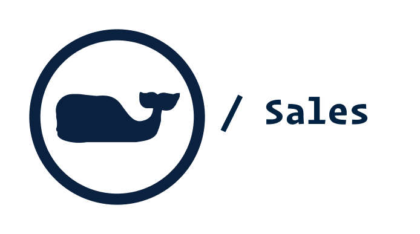

<h1 align="center">
  <br>
  <a href="https://github.com/nicholasadamou/vineyard-vines-sales"></a>
  <br>
  Vineyard Vines / Sales
  <br>
</h1>

<h4 align="center">A dynamic web app that fetches and displays the latest Vineyard Vines sales</h4>

<p align="center">
  <a href="https://github.com/nicholasadamou/vineyard-vines-sales/blob/master/LICENSE.txt">
      
  </a>
  <a href="https://david-dm.org/nicholasadamou/vineyard-vines-sales#info=devDependencies">
      
  </a>
  <a href="https://dependabot.com">
      
  </a>
  <a href="https://travis-ci.org/nicholasadamou/vineyard-vines-sales">
      
  </a>
  <a href="https://saythanks.io/to/NicholasAdamou">
      
  </a>
</p>

---

## What is '_Vineyard Vines / Sales_'?

I started this project first as a web-scrapper to obtain the latest data on their sales for mens and womens. Then, I decided, since I have the data from Vineyard Vines, why not try to reconstruct their sales page for both men's an womens?

⚠️ To access the demo of 'Vineyard Vines / Sales' visit this link: [vineyard-vines-sales demo](https://vineyard-vines-sales.netlify.com/).

## 📚 The Tech. Stack

This project uses the following technologies:

**The Front-End**:

- [**React.js**](https://reactjs.org/) - For building the interface along with:
  - [**React Router**](https://reacttraining.com/react-router/) for declarative routing for React.
  - [**Styled-Components**](https://www.styled-components.com/) for styling.

**The Back-End**:

- [**JSSoup**](https://github.com/chishui/JSSoup) - JavaScript + [BeautifulSoup](https://www.crummy.com/software/BeautifulSoup/bs4/doc/) = JSSoup
  - For scraping [Vineyard Vines](https://vineyardvines.com/) and returning parsable data to the front-end.

## How To Use

```bash
git clone https://github.com/nicholasadamou/vineyard-vines-sales

cd vineyard-vines-sales

yarn install # alteratively, 'npm' can be used

yarn start
```

## License

Vineyard Vines / Sales is © 2019, Nicholas Adamou.

It is free software, and may be redistributed under the terms specified in the [LICENSE] file.

[license]: LICENSE
